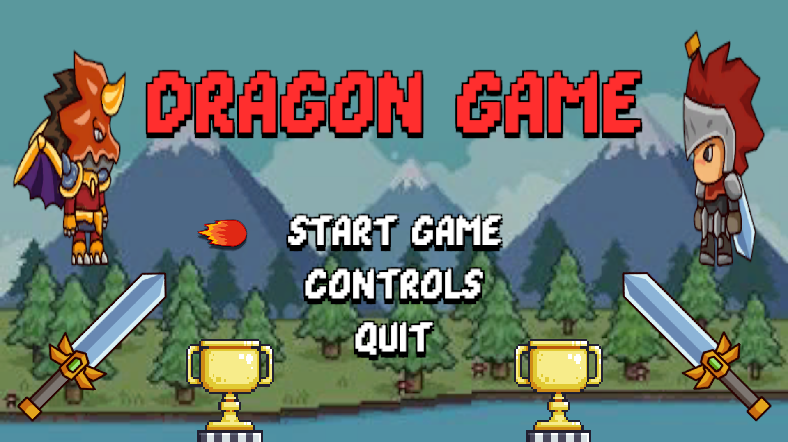
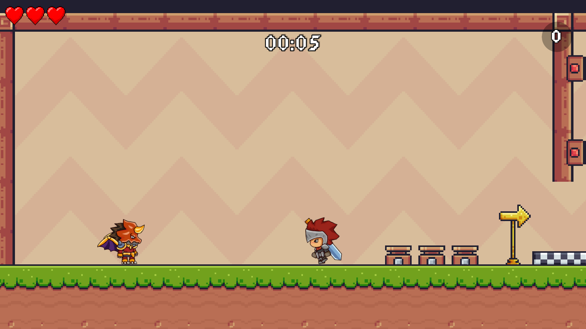
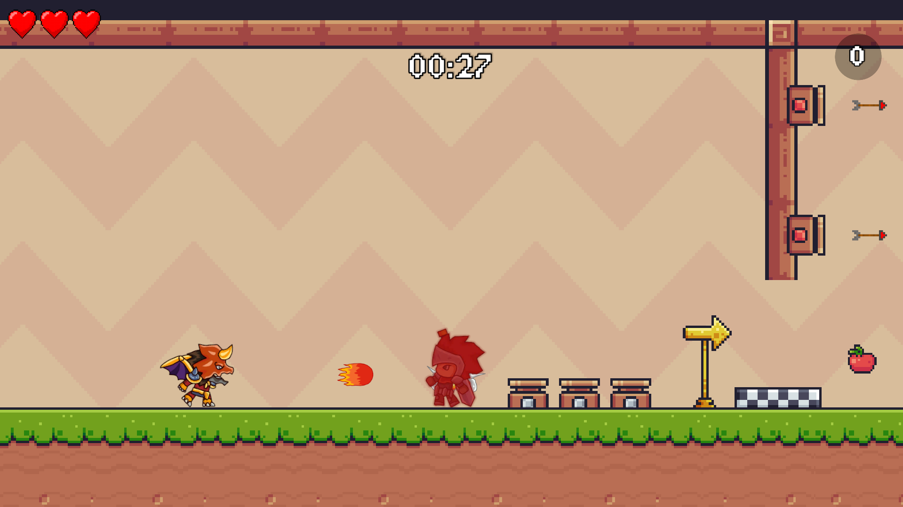
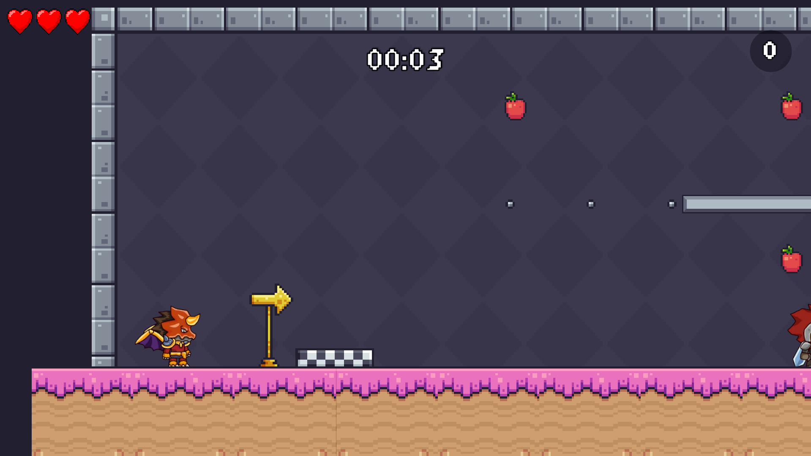
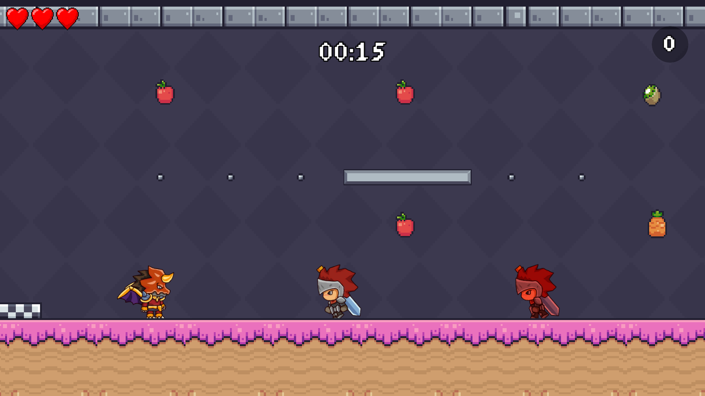
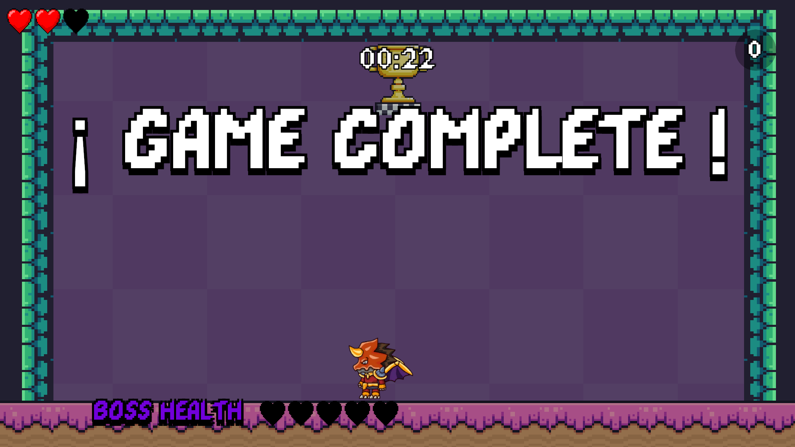
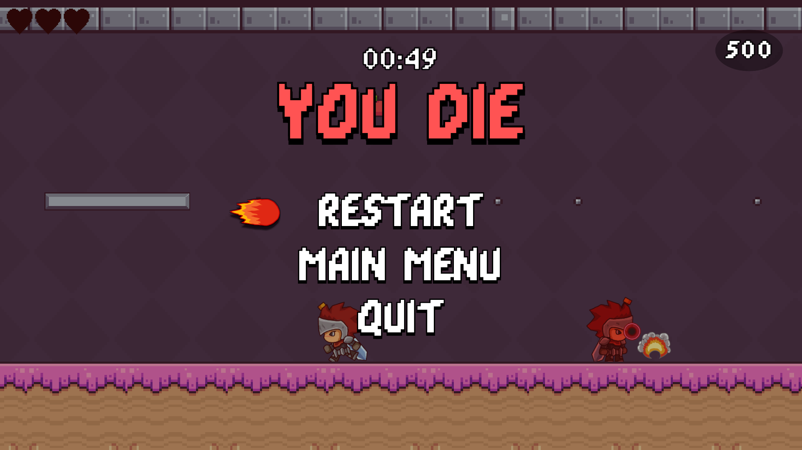
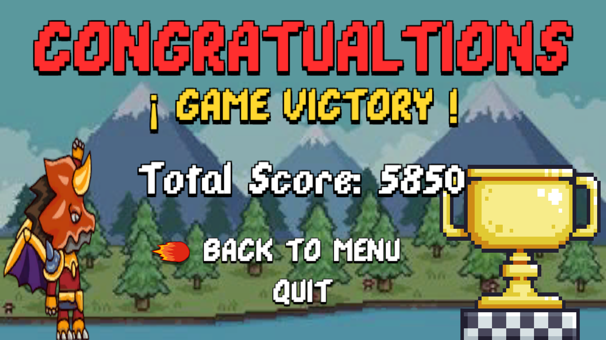

# Dragon Game: A 2D Platformer Adventure 🐉🎮

Juego en 2D de plataformas desarrollado en Unity para mi clase de Hipermedia.

## Descripción
**Dragon Game** es un juego de plataformas en 2D donde tomas el control de un valiente dragón en su aventura para alcanzar la meta y superar múltiples niveles llenos de desafíos. ¡Esquiva obstáculos, pasa por trampas, recoge frutas a través de los niveles, derrota enemigos y demuestra tus habilidades para llevar a tu dragón a la victoria!

## Características Principales

- **Control de Personaje:**
  - Movimiento lateral, salto, salto doble, ataque a enemigos con bolas de fuego y esquivar obstáculos.
  - Animaciones de caminar, salto, salto doble, ataque, recibir daño, muerte y reaparición.
  
- **Niveles y Escenarios:**
  - **Nivel 1:** Nivel claro..
    - **Nivel 2:** Nivel oscuro..
  - **Nivel Final:** El desafío enfrentando al jefe final del juego para obtener la victoria.

- **Enemigos y Obstáculos:**
  - Enemigos como caballeros con espadas para ataques cuerpo a cuerpo.
  - Enemigos con ataques a distancia.
  - Enemigos que patrullan ciertas áreas del mapa con ataques cuerpo a cuerpo y a distancia.
  - Obstáculos como espinas, trampas de fuego, trampas de flechas, sierras giratorias y plataformas móviles.

- **Score y Recolección de Objetos:**
  - Puntos por eliminar enemigos y recolectar frutas en el mapa.
  - Vidas extra a lo largo de los niveles.
  - Contador de tiempo y vidas restantes.
  - Corazones que suman vidas adicionales y puntos al score del jugador.
  - Trofeos al final de cada nivel para avanzar al siguiente.

- **Sonidos y Efectos:**
  - Música épica de fondo y efectos de sonido para todas las acciones.
  - Efectos visuales como animaciones de los personajes, explosiones y destellos al derrotar enemigos.

## Capturas de Pantalla
Aquí puedes ver algunas capturas de pantalla del juego:

- **Pantalla Principal:**

  

- **Nivel 1:**

  
  
  

- **Nivel 2:**

  

  

- **Nivel Final:**

  

  

- **Game Over:**

  

- **Victoria y juego completado:**

  

## Cómo Jugar
1. **Movimiento:** Usa las teclas de dirección para moverte a la izquierda o derecha.
2. **Saltar:** Pulsa la tecla de "espacio" para evitar obstáculos.
3. **Atacar:** Usa la tecla "X" para atacar a los enemigos.
4. **Seleccionar algo en el menú:** Usa la tecla "E".
5. **Objetivo:** Alcanza la meta al final de cada nivel para avanzar al siguiente.

## Mejoras Futuras
Este juego tiene una estructura modular que facilita la adición de nuevas características en el futuro. Algunas mejoras que se pueden considerar:
- **Nuevos Niveles:** Agregar más escenarios y desafíos.
- **Poderes Especiales:** Introducir habilidades únicas para el dragón.
- **Modo Multijugador:** Permitir que dos jugadores compitan o cooperen.

## Créditos
Este juego fue desarrollado como parte de un proyecto académico para mi clase de Hipermedia. Agradezco a mis compañeros y profesores por el apoyo y la retroalimentación a lo largo del desarrollo. También agradezco al canal de mi amigo Pandemonium por la inspiración para crear este videojuego: [Pandemonium Game Dev](https://www.youtube.com/@PandemoniumGameDev).

## Contacto
Para preguntas, sugerencias o contribuciones, puedes contactarme en: [robertocarlosmartinez.contact@gmail.com](mailto:robertocarlosmartinez.contact@gmail.com)
